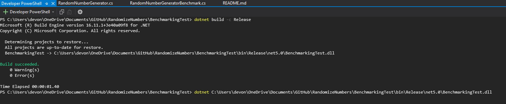
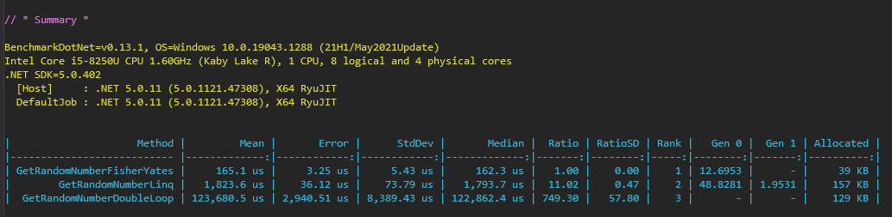

# GenerateRandomNumbers
Coding challenge

This is a coding challenge where the user can generate 10 000 unique numbers in a random order. After the user hits the generate button, the numbers (from 1 <= n <= 10 000) are displayed in random order. Since they are unique,
there are no duplicates.


To visit the Web UI visit: https://generateabunchofnumbers.azurewebsites.net/
Click on the "Generate" button to view the output, which is 10 000 unique numbers, from 1 to 10 000, displayed in a random order.


Steps to replicate project and run solution:

1) Clone the repo on to your local machine from : https://github.com/devonblackbeard/RandomizeNumbersCodingChallenge
2) Navigate to the RandomizeNumbers project and press CTRL + F5 to launch the Console Application.
3) View Output.


My Strategy
1)	My first attempt to generate the numbers was to use an algorithm that uses a for loop to iterate over ten thousand numbers, selecting a random number in that range. I add that number to an originally empty list on each iteration. If the list already contains that value, a while loop will run until it finds a number that is not in the list. I knew instinctively that this would be very inefficient, because as you progress in the for loop, more of the numbers are already in the list, thus it takes longer and longer to find unique numbers to add.

2)	My second attempt was a Linq query. I simply use the Enumerable.Range class to generate a list of integers, from 1 to 10 000 (inclusive). I then use the .OrderBy method, with a random number generator as the anonymous  function parameter. This enables me to order the numbers in a random way. I then convert to a list.
 
    ```Enumerable.Range(1, numberIterations).OrderBy(e => random.Next()).ToList();```

    This method is much better than the first, however I knew from experience that LINQ is not always the most efficient way to achieve something. Although this is a nice one liner, it would only be acceptable for sufficiently small lists. In the case of 10 000 numbers, we need something more efficient. Enter Fisher–Yates.

3)  After some research, I found that the Fisher-Yates shuffle is the most efficient way to shuffle a list of items. From Wikipedia: "Fisher-Yates is an algorithm for generating a random permutation of a finite sequence—   in plain terms, the algorithm shuffles the sequence". In this code, I walk through the list from start to end, generating a random index at each step. This index is found by generating a random number between the current index and the max number of elements in the list (the count). I then swap the elements at the iteration index (listOfInt[i]) and the randomly found index (listOfInt[index]), until I reach the end of the list. This solution is the best because it contains only one loop, unlike my first attempt.
	
    ```    
            for (int i = 0; i < count - 1; i++)
            {
                int index = i + random.Next(count - i);
                int temp = listOfInt[index];

                listOfInt[i] = temp;
                listOfInt[index] = listOfInt[i];
            }            
    ```


Testing:
To confirm that Fisher-Yates is the most efficient, I used the Nuget package Dotnet Benchmark, which can output the mean runtimes of each algorithm and also measure memory usage.


Steps to run Benchmark:

1) After cloning the project, cd into the BenchmarkTests project.
2) Run the command: ``` dotnet build -c Release ```
3) Run the command: ``` dotnet <directory> ``` where directory is the output from step 2.
4) Wait for the benchmarks to run, then view the Summary table at the bottom.




Summary of Benchmark Tests:

The Fisher-Yates algorithm was the fastest, as it took only 165 microseconds on average. It also allocated the least memory, being 39KB.
The GetRandomNumberDouble loop was by far the slowest, as expected. It took about 123 690 microseconds on average. 
The GetRandomNumberLinq was in between the two, speed wise. It took about 1 823 microseconds on average. However, it allocated the most memory, at 157 KB.


In summary, the Fisher-Yates was the most efficient way to solve this coding problem. The Benchmark tests proved its efficiency over the others. This application is a deployed MVC application, hosted with Azure. It contains two projects, an MVC application and a console application. The "generate" button on the front end of the MVC app calls an endpoint in the controller which uses Fisher-Yates to generate the numbers, and display them on the front end. In that controller method, a check is performed to ensure all elements are unique, using LINQs' .Distinct() method. An exception is thrown if they are not unique. In future, I would use a testing framework like NUnit to perform this check, rather than throwing an exception to the user.